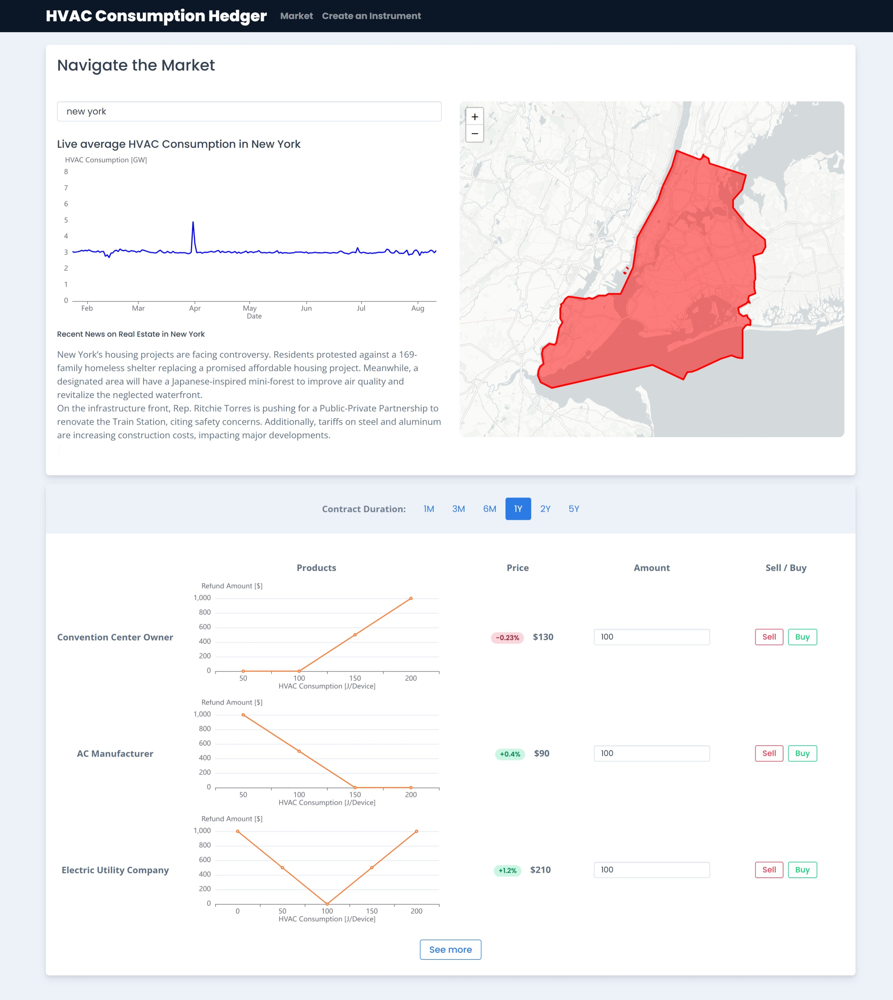

# Overclocked Neurons

## Overview

Businesses relying on HVAC systems face a critical challenge: unexpected weather conditions can lead to drastic fluctuations in cooling costs. Currently, financial instruments like weather derivatives help mitigate these risks by providing payouts when temperatures exceed predefined thresholds. However, existing contracts rely on temperature approximations rather than actual energy consumption data.

This project introduces a new type of [weather derivative](https://thedocs.worldbank.org/en/doc/29d15a97a9791b5e6cfac1c302d08f08-0340012023/original/product-note-index-based-weather-derivative.pdf) based on real-time HVAC energy consumption data collected by Belimo’s sensors. By leveraging precise operational data instead of generalized weather metrics, businesses can access more accurate and fair financial protection while Belimo unlocks a new revenue stream.

## The Problem

- Unpredictable Weather Costs: Businesses such as data centers, shopping malls, and hotels face volatile energy expenses during heatwaves.
- Inefficient Risk Models: Current weather derivatives rely on temperature proxies, which may not accurately reflect actual energy usage.
- Missed Revenue Opportunities: Belimo already collects HVAC performance data, but it is not yet monetized in financial markets.

## The Solution

We propose a data-driven financial model that transforms Belimo’s HVAC sensor data into a trusted benchmark for weather derivatives. Instead of relying on broad weather station data, contracts will be structured based on actual cooling energy consumption, making risk mitigation more precise and cost-effective.

## Key Benefits:

- Enhanced Accuracy: Replaces [temperature proxies](https://www.sciencedirect.com/science/article/abs/pii/S104402830700021X) with actual HVAC energy usage data.
- New Revenue Stream for Belimo: Belimo can charge commissions for providing high-resolution energy consumption data to financial institutions.
- Better Financial Protection for Businesses: More reliable and tailored risk coverage for customers facing extreme temperature fluctuations.
- Scalability: The model can be expanded to cover various climatic risks (e.g., heating costs in winter).

## How It Works

1. Data Collection: Belimo’s sensors continuously measure real-time HVAC energy usage across client facilities.

2. Smart Contracts & API Integration: The collected data feeds into automated financial contracts, ensuring transparency and accuracy in derivative settlements.

3. Risk Payouts: If predefined conditions (e.g., excessive cooling costs) are met, businesses receive payouts to offset increased energy expenditures.

4. Monetization: Belimo earns a commission for each data-backed financial contract executed through the trading platform. Either Belimo constructs it's own trading platform, either it sells its oracle data to a company specialized in matching clients for derivatives contracts. An example of such a platform is given in `demo/main.html` (see below).

## Market Potential

The global market for weather derivatives is valued at [$25 billion annually](https://carboncredits.com/weathering-the-storm-the-rise-of-25b-weather-derivatives-market/) and continues to grow. By integrating precise HVAC data into these contracts, Belimo positions itself as a key player in a rapidly evolving financial sector.

## Conclusion

Belimo has long been a leader in optimizing HVAC energy efficiency. This project represents the next step in monetizing real-time sensor data, transforming it into a valuable financial instrument. By bridging the gap between IoT-driven energy insights and financial risk management, we are redefining how businesses protect themselves against climate uncertainty.

## Contributions

Sebastian Maier*, Sébastien Delsad*, Mikulas Vanousek*, Kamel Charaf*

**START Hackathon 2025**

*Equal contribution